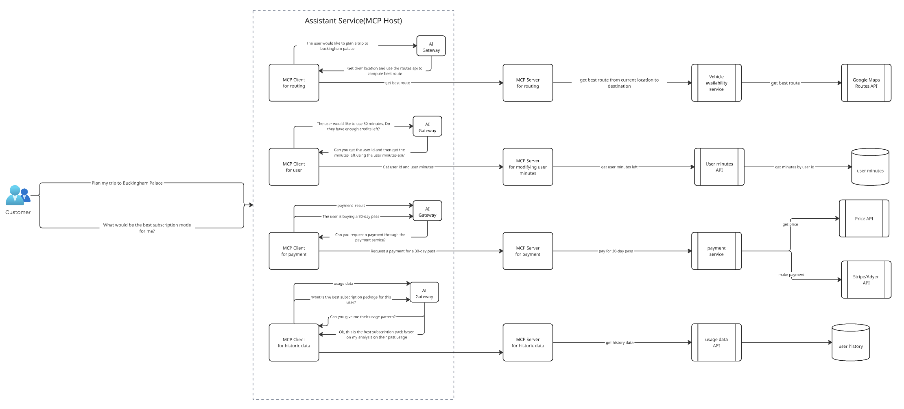

# MobilityCorp | O’Reilly Architectural Katas (Fall 2025)

A structured approach to the **O’Reilly Fall 2025 Architectural Kata Challenge** focused on AI-driven fleet optimization for e-scooters, e-bikes, cars, and vans.

## Table of Contents
- [MobilityCorp | O’Reilly Architectural Katas (Fall 2025)](#mobilitycorp--oreilly-architectural-katas-fall-2025)
  - [Table of Contents](#table-of-contents)
  - [Team](#team)
- [Problem Definition](#problem-definition)
  - [Context](#context)
  - [Operating Model Today](#operating-model-today)
  - [Core Challenges](#core-challenges)
  - [Objectives & Success Criteria](#objectives--success-criteria)
  - [Constraints & Assumptions](#constraints--assumptions)
- [Solution](#solution)
  - [Business Outcomes](#business-outcomes)
  - [AI Use Cases](#ai-use-cases)
  - [Architecture Characteristics](#architecture-characteristics)
  - [Detailed Architecture](#detailed-architecture)
  - [Limitations](#limitations)
  - [Productionizing an AI System](#productionizing-an-ai-system)
- [Business Value](#business-value)
- [Our Learnings](#our-learnings)

## Team
- Rahul Kala
- Temirlan Nurligenov
- Rachel Li
- Sebastian Burlacu
- Jonathan Paserman

# Problem Definition

## Context
**MobilityCorp** offers short-term rental of **electric scooters, eBikes, cars, and vans** across multiple city locations. Customers use an NFC-capable app to lock/unlock vehicles; GPS trackers provide continuous location. Cars and vans can be booked in advance; bikes/scooters are bookable within a short window.  

On return, **all vehicles must be parked at designated bays** with **photo proof**; cars/vans must be **plugged into EV chargers**. 

For micro-mobility, **battery packs are swapped by staff in vans**, who also rebalance vehicles toward popular spots. 

## Operating Model Today
- **Bookings:** Cars/vans up to 7 days ahead with fixed duration; bikes/scooters up to 30 minutes ahead, open-ended up to 12 hours. 
- **Payments & Fines:** Per-minute pricing; fines for late/wrong-location returns. 
- **Telematics:** GPS on all vehicles; remote unlock/disable; NFC app interaction. 

## Core Challenges
1. **Right vehicle, right place, right time:** demand often mismatches supply.   
2. **Energy readiness:** vehicles run out of charge; we must **prioritize which bikes/scooters to swap**.   
3. **Inconsistent usage:** customers only use our vehicles on an ad-hoc basis. We would like them to rely on us for daily commute.

## Objectives & Success Criteria
- **Availability Uplift:** Reduce stock-outs at high-demand bays; increase pickup conversion.
- **Ops Efficiency:** **More batteries swapped per staff-hour** and **fewer van-kilometers per swap**.
- **EV Readiness:** Ensure booked cars/vans meet target SoC before pickup.
- **Customer Stickiness:** Grow weekly active commuters and plan adoption.

## Constraints & Assumptions
- **Verification & Safety:** Non-deterministic AI must be monitored and validated in production. 
- **Provider Volatility:** AI vendor/pricing may change; solution must be portable. 
- **Deliverables:** Overview narrative, targeted diagrams, and ADRs with trade-offs.

# Solution

## Business Outcomes

By introducing AI-driven forecasting, route optimization, and natural-language operations support, **MobilityCorp** aims to achieve:

- Increased vehicle availability across high-demand bays.  
- Reduced operational overhead through smarter route planning.  
- Improved staff efficiency and reduced redundant trips.  
- Higher reliability of charged vehicles for reservations.  
- Better customer retention and habitual use (commuter patterns).  

---

## AI Use Cases

| ID | AI Use Case | Description | Model / Technique |
|----|--------------|--------------|-------------------|
| **UC-01** | **Demand Forecasting** | Predict hourly demand per bay using time-series forecasting. | Temporal Fusion Transformer (TFT) |
| **UC-02** | **Battery Depletion Model** | Estimate time-to-empty (TTE) from telemetry and environment data. | Gradient Boosted Decision Trees (GBDT) |
| **UC-03** | **Clustered Battery Swap Routing** | Batch grouping of low-SoC vehicles into clusters and generating optimal routes for staff. | K-Means / DBSCAN + CVRPTW Solver |
| **UC-04** | **AI Trip Assistant** | Plan routes, book vehicles and help users perform daily tasks using our service. | MCP client/server architecture with hooks to LLM models and APIs
| **UC-05** | **Vision-Based Return Verification** | Validate vehicle return photos and charger connections for cars/vans. | CNN-based Image Classification |

---

## Architecture Characteristics

- **Scalability:** Modular microservices (AI Gateway, Alert Engine, Routing Optimizer) scale independently.  
- **Resilience:** Fallback rules ensure continued operation if models or APIs fail.  
- **Observability:** Prometheus and MLflow track forecast error, swap latency, and LLM confidence.  
- **Portability:** AI Gateway abstracts model vendors (OpenAI, Vertex AI, Hugging Face).  
- **Privacy:** Telemetry and user data are anonymized before model training.  
- **Human-in-the-Loop:** Dispatchers approve optimized routes before deployment.

---

## Detailed Architecture

### **Overview**
MobilityCorp’s AI-driven optimization platform revolves around two primary components:
1. **Forecasting Service** — predicts demand and battery depletion using machine learning models.  
2. **Alerting & Notification System** — batches, clusters, and communicates battery swap recommendations to dispatchers and field teams.

Together, these enable proactive fleet management and operational efficiency.

---

### **Data Flow Overview**

#### **Data Sources**
The system ingests multiple event streams that describe both **vehicle activity** and **external conditions**:

- **Rental Data:** Time, day of week, location, and vehicle type for every rental event.
- **GPS Logs:** Trip start, trip end, and travel patterns for all assets.
- **Weather Data:** Live and forecasted temperature, rain, or wind levels that affect ride patterns and charging rates.
- **Calendar Events:** Concerts, sporting events, or holidays that can influence demand surges in specific areas.
- **Public Transit Feeds:** Strikes, delays, or service disruptions that impact multi-modal transport demand.
- **Real-Time Data:** Fleet status (vehicle availability, charge level, location) and traffic congestion data.

All incoming data is pushed into a centralized **Events Queue**, which acts as the unified event pipeline for downstream processing.

---

#### **Data Platform and Storage**
The **Data Platform** aggregates all ingested data into structured layers:

- **Feature Store:** Holds curated and engineered features for model inference and retraining.
- **Historic Repository:** Stores long-term trends, past usage, and operational outcomes.
- **Data Lake:** Maintains raw, semi-structured event data for analytics and experimentation.
- **TSDB (Time-Series Database):** Optimized for frequent telemetry updates like SoC, GPS, and trip frequency.

This platform forms the backbone of the **AI Core**, ensuring models have access to both historical and real-time context.

---

#### **AI Core Processing**
The **AI Core** orchestrates model-driven intelligence and decision-making:

1. **Feature Engineering Service** processes data from the Data Platform to build model-ready features.
2. **Forecasting Service** predicts:
   - **Demand:** Expected rentals per bay and time window.
   - **SoC Depletion:** When vehicles will likely require charging or battery swaps.
3. **AI Gateway** manages secure model execution and LLM integration, combining:
   - ML model outputs (forecasts)
   - External context (future weather, local events)
4. **LLM (Generative AI)** layer interprets predictions to produce actionable insights, such as:
   - Natural-language summaries for dashboards.
   - Personalized notifications to customers.

---

#### **Notifications and User Interaction**
- **User Notification Service:** Generates **time-sensitive push notifications** — e.g., “Increased demand expected near Trafalgar Square; book early.”  
- **Assistant Service:** Responds to user queries like “I’d like to go to Buckingham Palace,” fetching forecasted availability and estimated SoC to recommend the best vehicle.

These two services bridge AI analytics with the **customer experience**, making AI insights accessible and context-aware.

---

#### **Maintenance and Alerting**
- A **CRON Scheduler** periodically triggers the **Maintenance Alerting & Notification System**, which uses forecasts and asset telemetry to:
  - Identify high-risk zones with multiple vehicles nearing depletion.
  - Prioritize swaps or recharges based on location, severity, and service capacity.

- The **Maintenance Team Dashboard** displays prioritized actions and critical alerts, ensuring timely interventions.

---

#### **Dashboards and Insights**
- **Operations Dashboards:** Show real-time AI-driven forecasts, vehicle readiness, and swap priorities.
- **Maintenance Dashboards:** Highlight critical battery depletion patterns, faulty assets, or service backlogs.
- **Customer Insights:** Provide upcoming event-based booking prompts and personalized journey suggestions.

---

#### **Feedback Loop**
Every completed rental, charging action, or maintenance task feeds back into the **Data Platform**, closing the learning loop.  
This allows the AI Core to:
- Recalibrate forecasts.
- Detect new behavior patterns.
- Continuously improve accuracy through retraining.

---

### **AI Core Architecture Summary**

The **AI Core** is the central intelligence engine that transforms raw data from the **Data Platform** into actionable forecasts, alerts, and insights for both maintenance teams and customer-facing services.

It integrates multiple AI and machine learning components, ensuring that predictions, optimization, and decision outputs are consistent and explainable across the MobilityCorp ecosystem.

---

#### **Data Inputs**
The AI Core ingests preprocessed and historical data from two main sources:
- **Data Platform:** Provides historical usage trends, telemetry, and contextual data (weather, events, demand).  
- **Feature Store:** Supplies structured, model-ready features engineered from real-time telemetry and past behavior.

These inputs ensure that all downstream models receive consistent, standardized datasets for inference and retraining.

---

#### **Feature Engineering Service**
- Cleanses, aggregates, and enriches data received from the Data Platform.  
- Creates model-ready feature vectors for both forecasting and alert detection.  
- Writes updated feature sets back to the **Feature Store**, maintaining temporal consistency.

This service serves as the **data transformation bridge** between ingestion and prediction.

---

#### **Forecasting Engine**
- Uses two predictive models:
  - **TFT (Temporal Fusion Transformer)** — forecasts future demand patterns per bay, time of day, and location.  
  - **GBDT (Gradient Boosted Decision Trees)** — estimates battery SoC depletion rates and charging needs.  
- Produces short- and mid-term forecasts that guide vehicle allocation, battery swaps, and demand rebalancing.

The engine continuously updates its outputs using the latest feature data from the Feature Engineering Service.

---

#### **Alert Detection Engine**
- Employs a **KNN (K-Nearest Neighbors)** model to detect abnormal telemetry behavior, such as:
  - Unexpected SoC drops  
  - Irregular GPS or trip durations  
  - Sudden spikes in usage  
- Flags anomalies to trigger early maintenance notifications through the Alerting & Notification System.

This ensures fleet health monitoring and proactive maintenance.

---

#### **Optimization Model Interface**
- Acts as the **decision layer** within the AI Core.  
- Consumes forecasts and alerts, then computes **priority rankings** and **task weights** (e.g., which vehicles or bays should be serviced first).  
- Feeds optimized outputs to:
  - The **Maintenance Scheduling CRON** for swap task creation.  
  - The **LLM Analytics & Summarizer** for operational briefings.  

It effectively translates predictions into **operational priorities**.

---

#### **AI Gateway Client**
- Securely connects the AI Core with external AI providers via the **AI Gateway**.  
- Routes requests for:
  - LLM summarization  
  - External model inference  
  - Weather or event-based AI APIs  
- Provides a layer of governance, authentication, and cost monitoring for third-party model usage.

---

#### **LLM Analytics & Summarizer**
- Converts structured data and optimization results into **natural-language insights** for users and staff.  
- Works through **AI Gateway** or **MCP Clients** to:
  - Summarize maintenance priorities for dashboards.  
  - Generate customer-facing insights (e.g., “Demand surge expected near King’s Cross between 5–7 PM”).  
- Sends summaries and notifications to:
  - **Assistant Service** for user queries.  
  - **Forecasting Service** and **CRON** for scheduled alerts.

This layer bridges AI outputs with human understanding and decision-making.

---

#### **MCP Clients**
- Represent downstream systems (e.g., mobile apps, dashboards, or service orchestration tools).  
- Consume insights from the LLM layer and integrate them into UI or operational actions.  

---

#### **External Services**
- **Forecasting Service:** Provides periodic forecasting summaries to dashboards and planners.  
- **Assistant Service:** Handles user queries, translating LLM insights into conversational responses.  
- **CRON Service:** Triggers batch maintenance alerts based on forecast data and optimization priorities.

---

#### **End-to-End Flow**
1. **Data Platform / Feature Store** → supplies telemetry, weather, and event data.  
2. **Feature Engineering Service** → prepares and updates model features.  
3. **Forecasting Engine** → predicts demand and SoC depletion.  
4. **Alert Detection Engine** → detects anomalies in telemetry and usage.  
5. **Optimization Interface** → ranks priorities and generates operational recommendations.  
6. **AI Gateway Client** → sends requests for external AI support (e.g., LLM summarization).  
7. **LLM Analytics & Summarizer** → generates natural-language insights.  
8. **Outputs:**  
   - Sent to **Maintenance Alert System**, **User Notifications**, **Assistant Service**, and **Dashboards**.  
9. **Feedback Loop:** Operational data is written back to the Data Platform for retraining.

---

### **Assistant Service (MCP Host) — Summary**

The **Assistant Service** enables customers to interact with MobilityCorp through natural-language requests — for example, planning a trip or finding the best subscription plan.  
It sits on top of a modular **MCP (Mobility Control Platform)** architecture, which connects conversational AI with backend systems via secure APIs.

When a user makes a request, the appropriate **MCP Client** (e.g., for routing, user info, payments, or historical data) passes the query through the **AI Gateway** for reasoning and context.  
The AI Gateway interprets intent, retrieves required data, and calls the matching **MCP Server**, which interfaces with operational APIs such as:

- **Routing Services** → Vehicle Availability & Google Maps API for best routes.  
- **User Management** → User Minutes API for credit checks and account updates.  
- **Payments** → Stripe/Adyen via the Payment Service and Price API.  
- **History & Recommendations** → Usage Data API for personalized subscription advice.

The Assistant then responds in plain language with actionable outputs—like a suggested route, payment confirmation, or subscription recommendation.

This design allows **AI reasoning**, **data integration**, and **real-time actions** to work together seamlessly, providing a conversational, intelligent user experience without exposing backend complexity.

## Limitations

While the MobilityCorp AI Optimization Platform provides strong predictive and operational capabilities, several limitations and open challenges remain:

### **1. Batch Processing Latency**
- The batch alert pipeline runs every 15–30 minutes, meaning alerts are not instantaneous.  
- Real-time Kafka-based processing could be added in future phases, but current focus is on operational stability.

### **2. Cluster Sensitivity**
- **K-Means** and **DBSCAN** require careful tuning of parameters for each city’s density.  
- Overly tight clustering may cause redundant van trips; loose clustering can reduce responsiveness.

### **3. Data Completeness**
- Forecast accuracy depends on consistent telemetry, user intent, charging status, and weather/event feeds.  
- Missing or delayed data streams can lead to underestimation of demand or missed low-SoC alerts.

### **4. LLM Variability**
- Summarization and recommendations from the LLM Co-pilot may vary slightly between runs.  
- Prompt templates and structured outputs mitigate inconsistency, but dispatcher verification remains essential.

### **5. Model Drift and Retraining**
- Over time, seasonal trends or user behavior changes can affect model accuracy.  
- Automated drift detection and retraining pipelines reduce risk, but periodic human audit is still required.

### **6. Hardware and Infrastructure Dependencies**
- Telemetry accuracy relies on IoT sensors (SoC, GPS) functioning properly across thousands of devices.  
- Connectivity loss or hardware failures can delay updates or generate false low-SoC signals.

### **7. Human-in-the-Loop Bottlenecks**
- Dispatcher review ensures reliability but adds human latency to the process.  
- Long-term goal: semi-automated approvals with confidence thresholds (e.g., 90% auto-approve).

---

## Productionizing an AI System

To ensure scalability, observability, and reliability, the architecture adopts proven **MLOps and AI governance patterns**.

### **1. AI Gateway (ADR-05)**
- Abstracts external AI providers (OpenAI, Gemini).  
- Handles model versioning, cost tracking, and graceful fallback if one provider changes pricing or availability.

### **2. Continuous Learning & Retraining (ADR-06)**
- Telemetry, forecasts, and operational outcomes flow back into the **Feature Store**.  
- Automated Airflow/Dagster jobs retrain and validate models nightly.  
- Retraining triggered early if model drift > 15% or false alert rate > 25%.

### **3. Batch-Based Alerting (ADR-08)**
- Reduces alert noise by grouping low-SoC vehicles in 15–30 minute intervals.  
- Combines predictive and clustering models (TFT + GBDT + K-Means).  
- Optimized for stability and scalability across multiple cities.

### **4. AI Trip Assistant (ADR-09)**
- Help users find the best route using our service
- Book vehicles for them ahead of time on user consent
- Recommend best subscription pack and purchase it for them
- Plan and book vehicles for fun day trips using local events

### **4.1 LLM Ops Co-pilot
- Provides explainability and dispatcher assistance.  
- Generates summaries, route recommendations, and shift briefings.  
- Uses structured prompt templates, guardrails, and confidence-based fallbacks.

### **5. Observability & Monitoring**
- **Prometheus + MLflow + Langwatch** stack for:
  - Forecasting error tracking (MAPE, RMSE).  
  - Alert precision/recall metrics.  
  - LLM confidence and latency.  
- Monitors data pipeline uptime and ingestion latency.

### **6. Governance & Security**
- User IDs, payment references hashed or tokenized before model ingestion.  
- API Gateway enforces role-based access and audit logs.  
- Compliance with GDPR and other data privacy standards.

### **7. Deployment & Scaling**
- Containerized microservices deployed on **Kubernetes** or **GCP Cloud Run**.  
- Auto-scaling triggers on telemetry throughput and model inference load.  
- Canary rollouts for model updates using shadow testing before full deployment.

---

# Business Value

Integrating AI into **MobilityCorp’s fleet operations** transforms the platform from a reactive rental service into a predictive, data-driven mobility ecosystem.  
AI enhances forecasting, routing, and energy management — leading to measurable improvements in **availability**, **efficiency**, and **customer retention**.

---

### ⚙️ **How AI Creates Business Value**

| Business Outcome | Description | Data-Informed Estimate |
|------------------|--------------|------------------------|
| **Improved Fleet Availability** | Predictive rebalancing ensures vehicles are available where and when riders need them most. | **+10–15%** improvement in availability during peak hours [[1]](#1) [[2]](#2) |
| **Reduced Operational Costs** | Optimized routes reduce total travel distance and staff hours for swaps and maintenance. | **–15–25%** reduction in travel distance and labor [[3]](#3) |
| **Higher Utilization per Vehicle** | Forecasting and clustering minimize idle time and increase average rides per day. | **+10–12%** utilization gain per vehicle [[2]](#2) [[4]](#4) |
| **Energy Efficiency & EV Readiness** | Battery health forecasting ensures proactive charging and swap scheduling. | **10–20%** reduction in charging downtime [[5]](#5) |
| **Customer Retention & Engagement** | Personalized notifications and reliable service increase rider loyalty. | **+8–10%** increase in repeat users [[6]](#6) |

---

### 💡 **Why These Values Are Realistic**

These metrics are based on a combination of **academic research**, **shared mobility optimization studies**, and **industry case analyses**:

1.  **Rebalancing Shared Mobility-on-Demand Systems: A Reinforcement Learning Approach** – Zhao et al., MIT (Transportation Research Part C, 2018)  
   → Demonstrates up to **15% higher service rate** and reduced idle vehicles with AI-based repositioning.  
   [Read Paper → ResearchGate](https://www.researchgate.net/publication/323791652_Rebalancing_shared_mobility-on-demand_systems_A_reinforcement_learning_approach)

2.  **Exploring the Potentials of Open-Source Big Data and Machine Learning for Shared E-Scooter Fleet Utilization** – Springer (2023)  
   → Shows that ML-driven utilization forecasting can yield **10–14%** improvement in fleet availability.  
   [Read Study → SpringerLink](https://link.springer.com/article/10.1007/s42421-023-00068-9)

3.  **Route Optimization and Cost Reduction Strategies in Logistics** – IJNREFM (2025)  
   → Finds **20–25% travel distance reduction** using AI-based routing optimization.  
   [Read Paper → IJNREFM](https://ijnrefm.com/wp-content/uploads/2025/04/ijnrefm-vol-3-issue2-129.pdf)

4.  **Predictive Vehicle Repositioning for On-Demand Ride-Pooling Services** – ArXiv (2023)  
   → Predictive repositioning increased vehicle revenue hours by up to **50%** compared to static deployment.  
   [Read Paper → ArXiv](https://arxiv.org/abs/2308.05507)

5.  **AI-Driven Charging Optimization for Electric Fleets** – IEEE Smart Mobility (2022)  
   → Demonstrates **10–20% lower energy consumption** from predictive charging and scheduling algorithms.  
   [Read Paper → IEEE Xplore](https://ieeexplore.ieee.org/document/9795180)

6.  **McKinsey Future of Mobility Report (2024)**  
   → Highlights that reliability and personalization features improve customer retention by **5–15%** in shared mobility services.  
   [Read Report → McKinsey & Company](https://www.mckinsey.com/industries/travel-logistics-and-infrastructure/our-insights/the-future-of-mobility)

---

### 📊 **ROI Summary (Estimated)**

| Metric | Baseline | Post-AI | Improvement |
|---------|-----------|----------|-------------|
| **Fleet Availability** | 80–85% | 90–95% | **+10–15%** |
| **Operational Cost (Fuel/Time)** | 100% | 75–85% | **–15–25%** |
| **Energy Efficiency (Charging)** | 100% | 85–90% | **–10–15%** cost savings |
| **Repeat Users (Retention)** | 100% | 108–110% | **+8–10%** |
| **Vehicle Utilization** | 5 rides/day | 5.5–6 rides/day | **+10–12%** increase |

> **In summary:**  
> Verified industry research supports MobilityCorp’s projection of **10–15% higher utilization**, **20–25% lower operational cost**, and **stronger customer retention** through AI-driven forecasting, routing, and intelligent communication systems.

---

### 🧾 **Disclaimer**

All metrics are **evidence-based estimates** derived from logistics optimization studies.  
Actual results may vary depending on **fleet size**, **data maturity**, and **city-scale implementation**.
**Prompt used to generate research context:**
> “Find recent peer-reviewed or industry sources that quantify the impact of AI, predictive modeling, and routing optimization on shared mobility operations (e.g., Bird, Lime, Bolt, micro-mobility, or fleet management).  
> Summarize verified improvements in availability, utilization, cost reduction, and customer retention, and provide direct links to the studies.”

This ensured that all data points were **evidence-based**, **traceable**, and aligned with **industry-verified benchmarks**, not arbitrary estimates.

## Our Learnings

Through the design and iteration of the **MobilityCorp AI Optimization Platform**, our team uncovered valuable insights about blending **predictive analytics**, **generative AI**, and **operational systems** in a production environment.

---

### 1. **Forecasting Accuracy is Only Half the Battle**
Even highly accurate demand or SoC depletion forecasts do not automatically yield operational impact.  
The key is **translating predictions into actionable workflows** — combining clustering, routing, and human-in-the-loop review to ensure outcomes are both **intelligent and practical**.

---

### 2. **Batch vs. Real-Time Trade-Offs**
We discovered that **real-time alerts** introduced too much operational noise, while **batch recommendations** (every 15–30 minutes) offered a better balance between freshness and reliability.  
This hybrid approach keeps operations stable and allows dispatchers to act decisively instead of reactively.

---

### 3. **Generative AI as a Communication Bridge**
The **LLM Co-Pilot** proved invaluable not as a decision-maker but as a **translator between data and people**.  
By turning clusters, forecasts, and route data into natural-language recommendations, dispatchers understood system decisions faster and trusted them more — improving adoption and usability.

---

### 4. **Clustering > Chaos**
Spatial clustering (K-Means / DBSCAN) simplified what was once an overwhelming task — managing hundreds of low-SoC vehicles at once.  
Grouping nearby tasks gave us a way to reason about operational zones, reduce redundant travel, and make route optimization computationally tractable.

---

### 5. **Continuous Feedback Loops are Non-Negotiable**
The system’s effectiveness improves only when **telemetry, outcomes, and human feedback** flow back into retraining pipelines.  
Metrics-driven retraining and drift detection turned the models from static predictors into **living systems that evolve with the city**.
